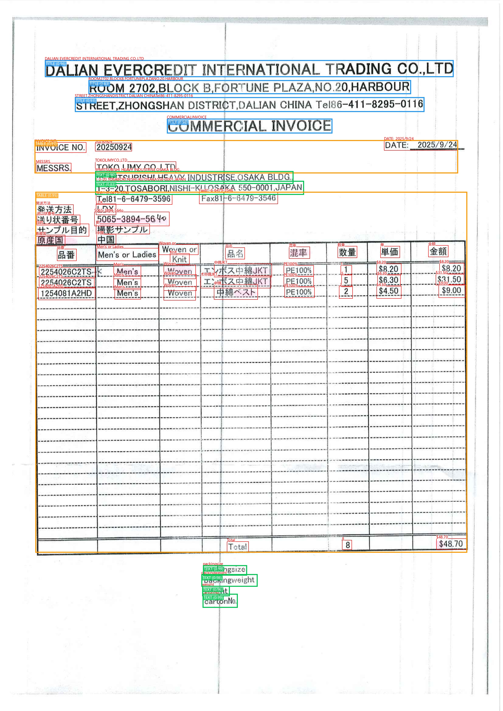

# OCR Invoice Reader

**Document Information Extraction System using PaddleOCR and PP-Structure**

A comprehensive Python package for extracting structured information from invoices, waybills, and other business documents with advanced table detection.

[](https://www.python.org/downloads/)
[](LICENSE)
[](setup.py)

## 🎯 Features

### Core Capabilities
- **🔍 Enhanced Structure Detection**: Coordinate-based table detection with 8+ regions per page
- **📊 Multi-Page PDF Support**: Process all pages automatically with batch output
- **🖼️ Official-Style Visualization**: OCR text boxes with region boundaries
- **🌍 Multi-language OCR**: Japanese, Chinese, English, Korean, and more
- **📝 Structured Extraction**: Document number, date, sender/receiver, amounts
- **⚡ Multiple Engines**: 4 different extraction modes for various use cases
- **🆓 Free & Open Source**: Based on PaddleOCR and PP-Structure

### Available Commands

| Command | Purpose | Best For |
|---------|---------|----------|
| **ocr-enhanced** | Enhanced structure + table detection | Production use (Recommended) |
| **ocr-raw** | PP-Structure raw output | Debugging, comparing results |
| **ocr-extract** | Structured field extraction | Document classification |
| **ocr-simple** | Simple text extraction | Quick text-only needs |

## 🖼️ Visual Examples

### Sample Visualization Output



**What you see in the visualization:**
- 🔴 **Red Polygons**: OCR text boxes showing character-level detection
- 🟧 **Orange Boxes**: Table regions with structure detection
- 🔵 **Blue Boxes**: Title and header regions
- 🟢 **Green Boxes**: Plain text regions
- 📝 **Text Labels**: Recognized text displayed above each region

### Quick Example

```bash
# Process a multi-page invoice with visualization
ocr-enhanced --image invoice.pdf --lang japan --visualize --use-cpu
```

**Output generates:**
- Precise text box coordinates for each character
- Region type classification (table/title/text)
- Confidence scores per region
- HTML table extraction for structured data
- One visualization image per page

### Multi-Language Support

| Language | Sample Document | Recognition Quality |
|----------|----------------|-------------------|
| 🇨🇳 Chinese | 中文发票、运单 | ⭐⭐⭐⭐⭐ Excellent |
| 🇯🇵 Japanese | インボイス、送り状 | ⭐⭐⭐⭐⭐ Excellent |
| 🇬🇧 English | Invoice, Waybill | ⭐⭐⭐⭐⭐ Excellent |
| 🇰🇷 Korean | 송장, 운송장 | ⭐⭐⭐⭐ Good |

**💡 Tip**: Use `--lang ch` for mixed-language documents (e.g., Japanese invoice with English company names).

> 📚 **See [VISUAL_EXAMPLES.md](VISUAL_EXAMPLES.md) for detailed examples, use cases, and comparison of all four extraction modes.**

## 📦 Installation

### Quick Install

```bash
pip install -e .
```

### Development Install

```bash
pip install -e ".[dev]"
```

### Docker Deployment 🐳

For containerized deployment with pre-configured Chinese fonts:

```bash
# Using Docker Compose (recommended)
docker-compose up --build

# Or using Docker CLI
docker build -t ocr-invoice-reader .
docker run -it --rm \
  -v $(pwd)/data:/app/data \
  -v $(pwd)/results:/app/results \
  ocr-invoice-reader ocr-enhanced --image /app/data/invoice.pdf --visualize --use-cpu
```

📖 **See [DOCKER_DEPLOYMENT.md](DOCKER_DEPLOYMENT.md) for detailed Docker setup and font configuration**

## 🚀 Quick Start

### Command Line Usage

#### Enhanced Extraction (Recommended)

```bash
# Process single PDF (all pages)
ocr-enhanced --image invoice.pdf --visualize --use-cpu

# Process with Chinese language model
ocr-enhanced --image invoice.pdf --lang ch --visualize --use-cpu

# Custom output directory
ocr-enhanced --image invoice.pdf --output-dir my_results --visualize --use-cpu
```

**Output Files:**
```
results/20260512_164550/
├── INVOICE_all_pages.json       # Complete structured data
├── INVOICE_all_pages.txt        # All extracted text
├── INVOICE_all_tables.html      # All detected tables
├── INVOICE_page_0001_viz.jpg    # Page 1 visualization
├── INVOICE_page_0002_viz.jpg    # Page 2 visualization
└── ... (one visualization per page)
```

#### PP-Structure Raw Output

```bash
# View PP-Structure original results
ocr-raw --image invoice.pdf --lang ch --visualize --use-cpu
```

#### Document Field Extraction

```bash
# Extract structured fields
ocr-extract --image invoice.pdf --visualize --use-cpu

# Batch processing
ocr-extract --input-dir invoices/ --visualize --use-cpu
```

#### Simple Text Extraction

```bash
# Quick text extraction
ocr-simple --image document.jpg --use-cpu

# Handwriting mode
ocr-simple --image handwritten.jpg --handwriting --use-cpu
```

### Python API Usage

```python
from ocr_invoice_reader import DocumentExtractor
from ocr_invoice_reader.processors.enhanced_structure_analyzer import EnhancedStructureAnalyzer

# Method 1: Enhanced Structure Analyzer (Best for tables)
analyzer = EnhancedStructureAnalyzer(use_gpu=False, lang='ch')
result = analyzer.analyze('invoice.pdf')

print(f"Method: {result['method']}")
print(f"Regions: {len(result['regions'])}")

for region in result['regions']:
    if region['type'] == 'table':
        print(f"Table: {region.get('rows')}x{region.get('columns')}")
        print(region['table_html'])

# Method 2: Document Extractor (Field extraction)
extractor = DocumentExtractor(lang='japan', use_gpu=False)
document = extractor.extract("invoice.pdf", visualize=True)

print(f"Type: {document.document_type}")
print(f"Number: {document.document_number}")
print(f"Sender: {document.sender.company}")
print(f"Confidence: {document.confidence:.1%}")
```

## 📊 Output Examples

### Enhanced Structure Output

```json
{
  "method": "coordinate_based",
  "total_pages": 10,
  "pages": [
    {
      "page_number": 1,
      "regions": [
        {
          "type": "table",
          "bbox": [46, 791, 3383, 1513],
          "rows": 10,
          "columns": 4,
          "confidence": 0.94,
          "table_html": "<table><tr><td>...</td></tr></table>"
        }
      ]
    }
  ]
}
```

### Document Extraction Output

```json
{
  "document_type": "waybill",
  "document_number": "HTL506539397733",
  "date": "2026-05-12",
  "sender": {
    "company": "SEKIAOI ELECTRONICS(WUXI)CO.,LTD",
    "address": "WUXI, JIANGSU, CHINA"
  },
  "receiver": {
    "company": "SEKI AOI TECHNO CO.,LTD",
    "address": "AICHI, JAPAN"
  },
  "confidence": 0.55
}
```

## 🏗️ Project Structure

```
ocr-invoice-reader/
├── ocr_invoice_reader/              # Main package
│   ├── cli/                         # Command-line interfaces
│   │   ├── enhanced_extract.py     # ocr-enhanced command
│   │   ├── raw_structure.py        # ocr-raw command
│   │   ├── main.py                 # ocr-extract command
│   │   └── simple_cli.py           # ocr-simple command
│   ├── processors/                  # Processing modules
│   │   ├── enhanced_structure_analyzer.py  # Enhanced table detection
│   │   ├── structure_analyzer.py   # PP-Structure wrapper
│   │   ├── field_extractor.py      # Field extraction rules
│   │   └── file_handler.py         # PDF/image processing
│   ├── extractors/                  # Extraction engines
│   │   ├── document_extractor.py   # Document field extraction
│   │   └── simple_ocr.py           # Simple OCR
│   ├── models/                      # Data models
│   │   └── base.py                 # Pydantic models
│   ├── utils/                       # Utilities
│   │   ├── visualizer.py           # Official-style visualization
│   │   ├── text_corrector.py       # Text correction
│   │   └── utils.py                # Helper functions
│   └── config/                      # Configuration
├── examples/                        # Example documents
├── docs/                           # Documentation
├── results/                        # Output directory
├── setup.py                        # Package setup
├── requirements.txt                # Dependencies
└── README.md                       # This file
```

## 🎨 Visualization Features

- **OCR Text Boxes**: Red polygons around each recognized text
- **Region Boundaries**: Color-coded boxes (Orange=Table, Blue=Title, Green=Text)
- **Text Display**: Recognized text shown above each box
- **Multi-Page Support**: Individual visualization for each page
- **Official Style**: Similar to PaddleOCR's original visualization

## 📚 Documentation

- [Visual Examples](VISUAL_EXAMPLES.md) - 🎨 Detailed visual examples and use cases
- [Quick Start Guide](docs/QUICK_START_GUIDE.md)
- [Document Extraction Guide](docs/DOCUMENT_EXTRACTION_GUIDE.md)
- [PP-Structure Optimization](docs/PP_STRUCTURE_OPTIMIZATION.md)
- [Solution Summary](docs/SOLUTION_SUMMARY.md)

## 🛠️ Development

```bash
# Install in development mode
pip install -e ".[dev]"

# Run tests
pytest

# Code formatting
black ocr_invoice_reader/

# Check syntax
python -m py_compile ocr_invoice_reader/**/*.py
```

## ⚙️ Requirements

- Python 3.8+
- PaddleOCR 2.8.1+
- PaddlePaddle 3.0.0+
- OpenCV 4.8.0+
- PyMuPDF 1.23.0+
- Pydantic 2.0.0+

See [requirements.txt](requirements.txt) for complete dependencies.

## 🌍 Language Support

| Language | Code | Support Level |
|----------|------|---------------|
| Chinese | `ch` | ✅ Excellent (Recommended for mixed documents) |
| English | `en` | ✅ Excellent |
| Japanese | `japan` | ✅ Good |
| Korean | `korean` | ✅ Good |
| Latin | `latin` | ✅ Good |

**Tip**: For documents with mixed languages, use `--lang ch` for best results.

## 📝 License

This project is licensed under the MIT License.

## 🙏 Acknowledgments

- [PaddleOCR](https://github.com/PaddlePaddle/PaddleOCR) - OCR engine
- [PaddlePaddle](https://github.com/PaddlePaddle/Paddle) - Deep learning framework
- [PP-Structure](https://github.com/PaddlePaddle/PaddleOCR/blob/main/ppstructure/README.md) - Document structure analysis

## 🆘 Support

For issues and questions:
1. Check [docs/](docs/) folder for detailed documentation
2. Review example outputs in [examples/](examples/)
3. Run diagnostic commands (`--help` flag on each command)

---

**Made with ❤️ using PaddleOCR and PP-Structure**

**Key Features:**
- ✅ Multi-page PDF support
- ✅ Enhanced table detection
- ✅ Official-style visualization
- ✅ Coordinate-based analysis
- ✅ 4 extraction modes
- ✅ Batch processing with timestamps
